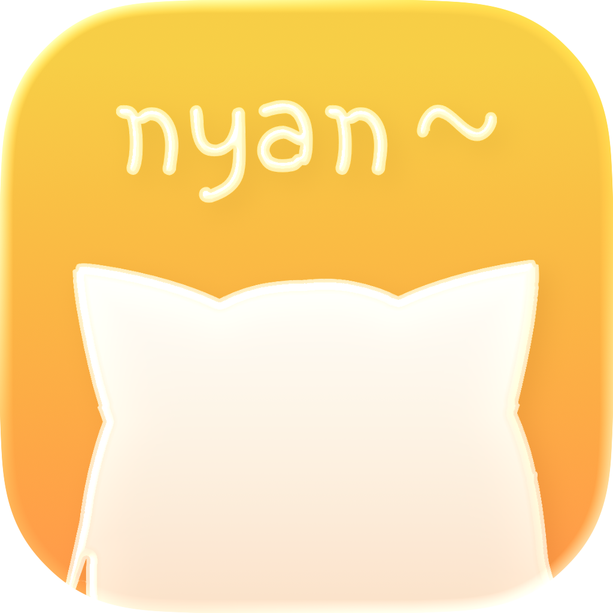
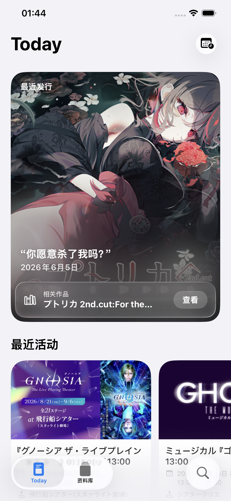
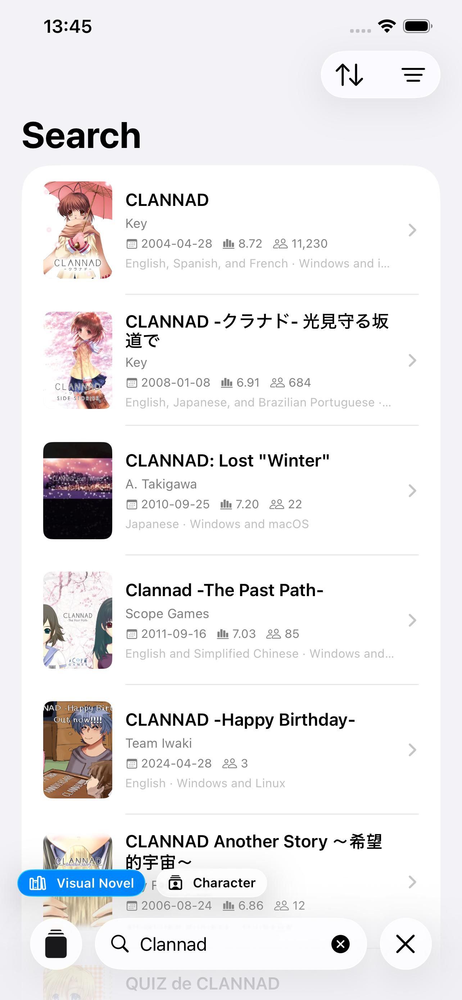
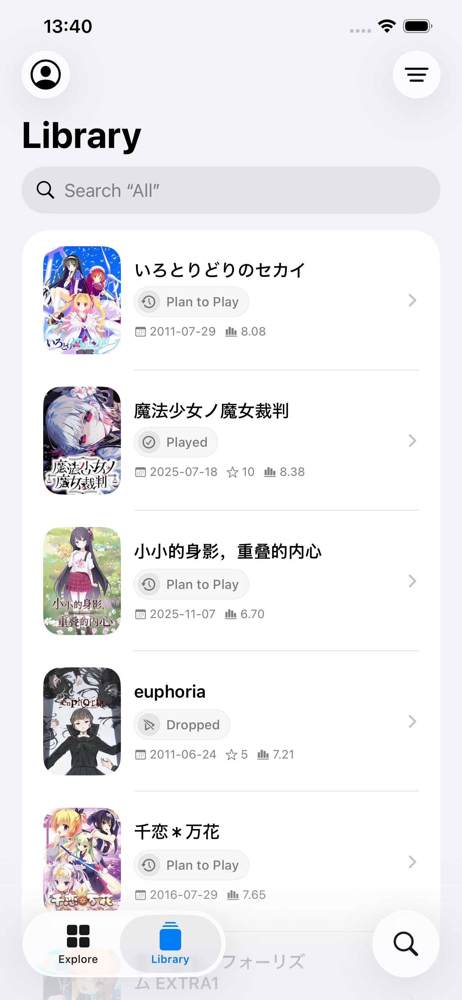
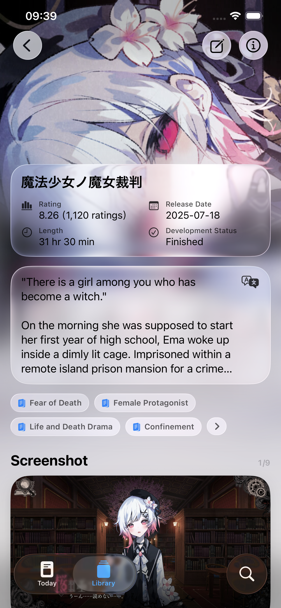

  <strong>English</strong> ·
  <a href="./README.zh-Hans.md">简体中文</a> ·
  <a href="./README.zh-Hant.md">繁體中文</a> ·
  <a href="./README.ja.md">日本語</a> ·
  <a href="./README.ko.md">한국어</a>

<table>
  <tr>
    <td></td>
    <td width="32"></td>
    <td align="left">
      <h1>PaperVN</h1>
      
<strong>Track &amp; Discover Visual Novel</strong>

    </td>
  </tr>
</table>

PaperVN is a visual novel companion built for Apple devices. It helps you discover visual novels, learn more about titles and characters, and record every step of your play journey. Browse, explore, and search VNDB's public data without signing in. After signing in to your VNDB account, you can also read and edit your personal library.

## Preview

  
  
  
  

Today · Search · Library · Visual Novel Details

## Description

### Coming Swiftly

Throughout its development, PaperVN has followed a “beauty first” principle. It is built entirely with SwiftUI, and every detail has been carefully considered.

### Today

Today presents a daily selection of visual novels worth your attention and recent events. PaperVN can also analyze your library and use machine learning to generate a “For You” list.

### Library

After signing in to your VNDB account, you can edit your library and update play status, played release, rating, and start or finish date. Preferences such as language, appearance, and content safety are customizable as well.

### Visual Novel / Character Details

PaperVN includes localizations for more than 6,000 VNDB visual novel tags and character traits, with support for Simplified Chinese, Traditional Chinese, English, Japanese, and Korean. We are also working to localize the descriptions of more than 200,000 visual novels and characters on VNDB.

### Search

Search visual novels, characters, releases, staff, developers, and publishers, then narrow the results with matching filter criteria.

## System Requirements

Requires an iPhone with iOS 26 or later, or an iPad with iPadOS 26 or later.

## License

This project is licensed under [CC BY-NC-SA 4.0](LICENSE). **The PaperVN name and icon are not covered by this license**. Third-party code, images, and data are subject to their own terms. See [NOTICE.md](NOTICE.md) for details.

## Disclaimer

PaperVN is an unofficial third-party app. It is not affiliated with or endorsed by VNDB, Bangumi, Steam, or KunGalgame.

## Donate

  
  &nbsp;&nbsp;
  

